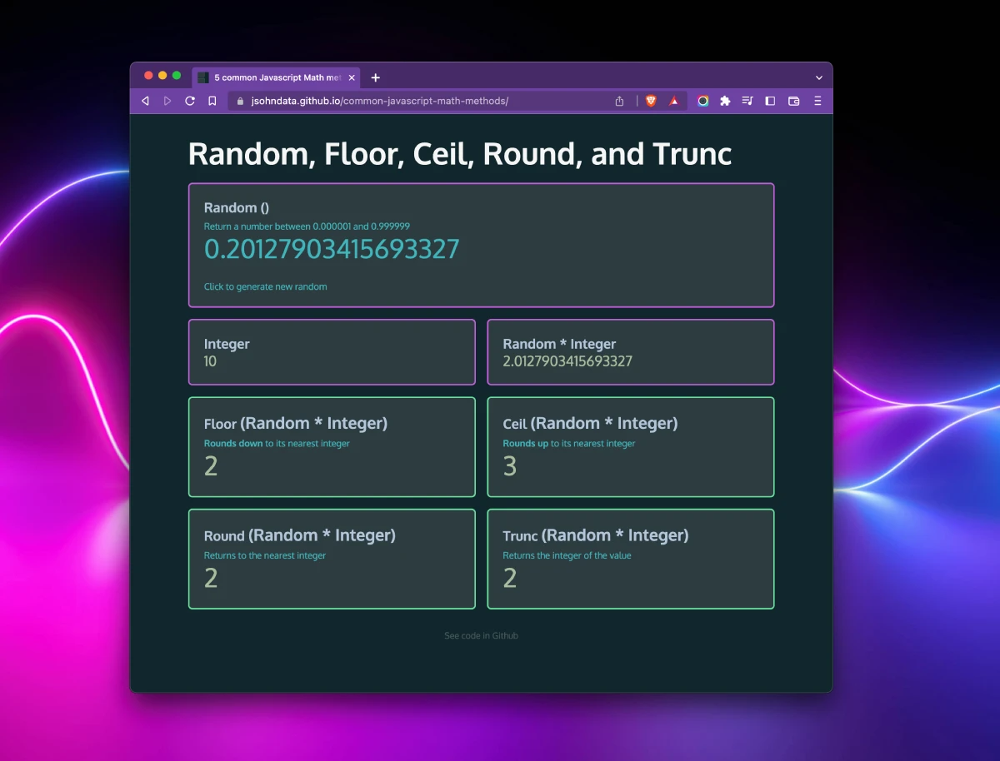

# Common Javascript Math Methods 
Exploring 5 common methods used with the Math object in Javascript: Random, Floor, Ceil, Round, and Trunc. Created for the students to understand the math methods.

 

## Site
* 👉 [jsohndata.github.io/common-javascript-math-methods](https://jsohndata.github.io/common-javascript-math-methods/)

